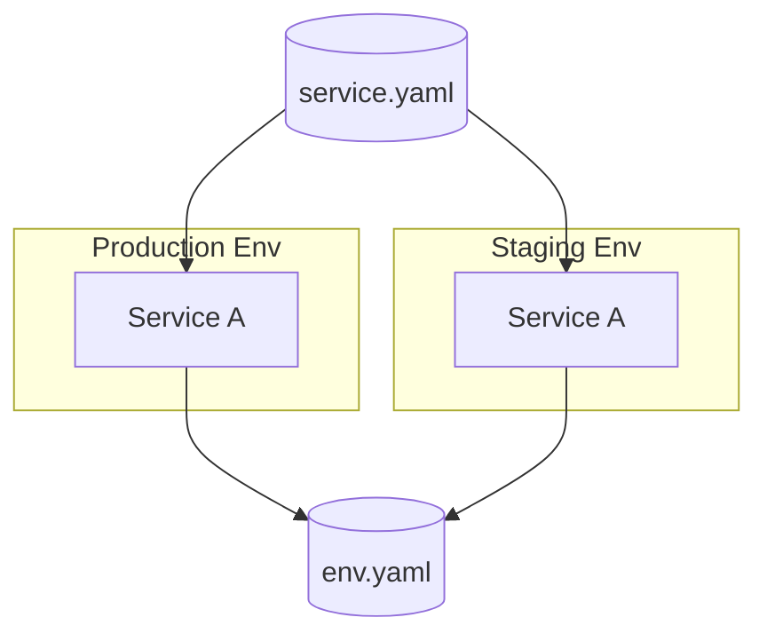

# pltf CLI 🚀

pltf (Platform Tools) turns your high-level infrastructure intent into ready-to-run Terraform workspaces with sensible defaults, inline validation, and repeatable security/cost scans. Instead of hand-editing Terraform everywhere, keep your infrastructure knowledge in reusable specs (`Environment`, `Service`, `Stack`) and let pltf generate modules, providers, backend wiring, and secrets integration for every run. Its Kubernetes-native workflow (EKS, Helm, clusters, charts) keeps workloads aligned with k8s best practices while still relying on standard Terraform state and tooling.

## Why teams choose pltf

- **Spec-first workflows** – capture environments, services, and stacks once in YAML and let pltf materialize Terraform, backend, and provider plumbing for every run.
- **Consistent Terraform runs** – `pltf terraform …` commands render the workspace, call the host `terraform` binary directly, stream tfsec/cost/rover output during execution, and auto-approve apply/destroy steps for deterministic CI/CD.
- **Image-aware operations** – Docker images declared in specs build through Dagger once per plan/apply with shared caches; apply pushes the tags while plan stops locally.
- **Security, cost, and drift guardrails** – builtin tfsec summaries (with problem lists) and optional Infracost reports pair with Terraform logs so risky changes are visible before deployment.
- **Composable toolchains** – mix the built-in modules with your own by placing `module.yaml` beside custom Terraform code; pltf treats every module the same when generating workspaces.

## Table of Contents

- [Install](#install)
- [Quickstart](#quickstart)
- [Specs & Concepts](#specs--concepts)
- [Terraform Workflows](#terraform-workflows)
- [Image & Terraform Caching](#image--terraform-caching)
- [Commands](#commands)
- [Behavior & Rules](#behavior--rules)
- [Provider Support](#provider-support)
- [Contributing](#contributing)

## Quickstart

1. **Define reusable stacks** (`stack-cluster.yaml`):

   ```yaml
   apiVersion: platform.io/v1
   kind: Stack
   metadata:
     name: k8s-cluster
     labels:
       tier: infra
   providers:
     aws: true
   modules:
     - id: network
       type: aws_network
       inputs:
         cidr_block: 10.0.0.0/16
     - id: eks
       type: aws_eks
       inputs:
         cluster_name: var.cluster_name
         vpc_id: module.network.vpc_id
         subnet_ids: module.network.private_subnet_ids
     - id: observability
       type: aws_logging
       inputs:
         log_bucket: var.log_bucket
   outputs:
     - name: cluster_name
       value: module.eks.cluster_name
   ```

2. **Declare the base environment** (`env.yaml`) that references the stack, backend, variables, secrets, and multi-arch images:

   ```yaml
   apiVersion: platform.io/v1
   kind: Environment
   metadata:
     name: enterprise-aws
     org: acme
     provider: aws
     stacks:
       - ./stack-cluster.yaml
   backend:
     type: s3
     bucket: acme-tfstate
     region: us-west-2
   environments:
     dev:
       account: "111111111111"
       region: us-west-2
       variables:
         log_bucket: dev-logs
     prod:
       account: "222222222222"
       region: us-east-1
       variables:
         log_bucket: prod-logs
   variables:
     cluster_name: enterprise-cluster
     base_domain: example.com
   modules:
     - id: dns
       type: aws_dns
       inputs:
         domain: var.base_domain
   images:
     - name: platform-tools
       context: .
       platforms:
         - linux/amd64
         - linux/arm64
       tags:
         - ghcr.io/acme/platform-tools:${env_name}
   secrets:
     aws:
       type: file
       path: ~/.aws/credentials
   ```

   Point to your own Terraform modules by dropping a `module.yaml` next to them and referencing them alongside the embedded modules in your spec.

3. **Add a service** (`service.yaml`) that reuses the environment stack, runs workload-specific modules, and deploys across any listed envs:

   ```yaml
   apiVersion: platform.io/v1
   kind: Service
   metadata:
     name: billing
     ref: ./env.yaml
     envRef:
       dev: {}
       prod:
         variables:
           replica_count: 3
   modules:
     - id: api
       type: helm_chart
       inputs:
         chart: ./services/billing/chart
         repo: ./services/billing
         values:
           cluster: module.eks.cluster_name
           replicas: var.replica_count
   secrets:
     db_password:
       type: file
       path: ~/.vault/db-prod.txt
   images:
     - name: billing-api
       context: ./services/billing
       tags:
         - ghcr.io/acme/billing:${env_name}
   ```

4. **Preview, validate, and run Terraform**:

   ```bash
   ./pltf preview -f env.yaml -e dev
   ./pltf validate -f env.yaml -e prod --scan
   ./pltf generate -f env.yaml -e prod
   ./pltf terraform plan -f env.yaml -e prod --scan --cost
   ./pltf terraform apply -f env.yaml -e prod
   ```

## Specs & Concepts



Environments describe the shared infrastructure (backends, stacks, provider mappings, account/region inputs) that every deployment reuses. Use `variables` for shared inputs, `secrets` for sensitive data, and `metadata.stacks` to include reusable stacks before generation.

Services reference an environment via `metadata.ref` and declare workload-specific modules, metadata, secrets, and images. Each entry under `metadata.envRef` can target a different environment—services live in as many environments as the spec lists, with optional overrides per env. The diagram above shows how a single service spec can plug into both production and staging envs via their YAML definitions.

Stacks bundle reusable modules with documented inputs, outputs, and provider requirements. Drop a `module.yaml` next to custom Terraform code, reference it, and pltf treats it like an embedded module during generation—this lets you bring your own modules in addition to the built-in catalog.

Variables and secrets stay first-class at every level: stacks/environments hold shared runtime inputs while services layer on overrides and secrets. Secrets never land in Git—pltf injects them while materializing the workspace.

Use services whenever you need workload-specific Terraform on top of a base environment. The billing service in the Quickstart example deploys a Helm chart (with module inputs such as `cluster` and `replicas`) into every linked environment while preserving the shared infra and generated workspace.

## Terraform Workflows

- Terraform commands run directly on the host inside the generated workspace; pltf materializes `.tf`, `.tfvars`, and wiring files before handing control to the host `terraform` binary (no additional wrapper layers).
- `pltf terraform plan` and `apply` build the declared Docker images through Dagger using the shared `pltf-image-cache` (plan stops after the build, apply pushes tagged images). `destroy` skips image builds entirely.
- Commands such as `plan` can include helpers like `--scan` (tfsec), `--cost` (Infracost), and `--rover`. `apply`/`destroy` always append `-auto-approve` so CI/CD pipelines run unattended.
- Every command reuses the generated workspace under `.pltf/<spec-name>/<env>/workspace`, ensuring plan/apply operate on the same graph and Terraform state.

## Image & Terraform Caching

- Image builds run through Dagger’s `Directory.DockerBuild`, mounting `pltf-image-cache` so BuildKit layers persist across commands. `platforms` lists drive multi-arch builds and default to the host OS/ARCH when unspecified.
- Terraform runs use the host binary and keep generated artifacts inside the workspace, so init/plan/apply/destroy all work against feature-parity Terraform state without extra caching layers.

## Commands

| Command                       | Description                                                                                           |
|-------------------------------|-------------------------------------------------------------------------------------------------------|
| `pltf generate`               | Materialize Terraform from an Environment or Service spec.                                           |
| `pltf validate`               | Lint a spec (`--scan` runs tfsec and prints findings).                                                |
| `pltf preview`                | Summarize provider/backend/stack/module wiring without executing Terraform.                         |
| `pltf version`                | Report pltf, Terraform, and key provider versions.                                                    |
| `pltf module init`            | Inspect a Terraform module and emit `module.yaml`.                                                   |
| `pltf module list`            | List embedded or custom modules available to specs.                                                  |
| `pltf module get`             | Show module inputs/outputs.                                                                          |
| `pltf terraform plan`         | Generate the workspace, build images, and run `terraform plan`. Supports `--scan`, `--cost`, `--rover`.|
| `pltf terraform apply`        | Build/push images and run `terraform apply` (auto-approved).                                          |
| `pltf terraform destroy`      | Skip image builds and execute `terraform destroy` (auto-approved).                                   |
| `pltf terraform output`       | Display Terraform outputs (`--json` for machine-readable output).                                    |
| `pltf terraform graph`        | Export dependency graphs (`--format`, `--outfile`).                                                   |
| `pltf terraform force-unlock` | Unlock a workspace state file (requires `--lock-id`).                                                 |

## Behavior & Rules

- Stacks merge before generation; stack modules and outputs cannot be overridden by environments/services.
- Environment/service variables only cover overrides after stacks merge; duplicate variable names throw errors.
- Providers are explicit; use the `providers` block to document requirements instead of inferring from module type.
- Auto-wiring matches outputs among the merged module set; conflicting outputs result in clear errors.
- Git refs in `metadata.ref` and `metadata.stacks` support remote specs (e.g., `https://host/org/repo.git//path/to/spec.yaml?ref=main`).

## Provider Support

| Provider | Status        |
|----------|---------------|
| AWS      | ✅ Supported   |
| GCP      | 🔜 Coming Soon |
| Azure    | ❌ Not Supported |
| Oracle   | ❌ Not Supported |

## Contributing

- Open issues/PRs for bugs, features, or module/provider additions.
- Provide reproducible steps, sample specs/module metadata, and `go test ./...` output when applicable.
- Keep diffs focused and cross-platform friendly.

_Note: running `go test ./...` here currently fails because `/Users/evalsocket/Library/Caches/go-build/...` is not writable and the Go toolchain version differs from `go 1.25.3`; these issues are environmental and unrelated to the repository._
