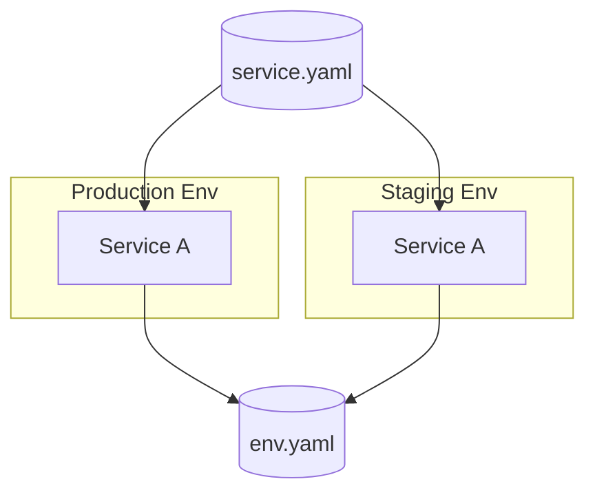

# pltf CLI 🚀

pltf (Platform Tools) turns high-level infrastructure intent into ready-to-run Terraform workspaces with sensible defaults, inline validation, and repeatable security/cost scans. Its Kubernetes-native workflow (EKS, Helm, charts) keeps workload definitions aligned with k8s best practices while still relying on the host `terraform` binary so you never trade portability for automation.

### Quick highlights

- **Spec-first automation** – define reusable `Stack`, `Environment`, and `Service` specs to capture clusters, backends, modules, providers, and secrets instead of hand-editing Terraform from scratch.
- **Terraform-native runners** – `pltf terraform …` renders the workspace, builds declared Docker images through Dagger when required, then runs the host `terraform` binary with reusable provider caches and `-auto-approve` for applies/destroys.
- **Image-aware execution** – multi-arch Docker images in specs reuse a shared Dagger cache; plan builds the artifacts once and apply both builds and pushes registered tags.
- **Bring-your-own modules** – reference built-in module types or point to your own Git repo (`https://…` or `git@…`) and pltf will clone, cache, and wire it without needing a global `modules_root`.
- **Cost/security guardrails** – `pltf terraform plan` streams tfsec/Infracost/Rover summaries (with problem lists) so issues surface before apply.

## Spec foundations



### Stack spec

Stacks capture reusable infrastructure modules (networking, observability, etc.) and publish outputs for services. Each stack can list required providers so environments treat every module consistently.

```yaml
apiVersion: platform.io/v1
kind: Stack
metadata:
  name: enterprise-cluster
modules:
  - id: network
    type: aws_network
    inputs:
      cidr_block: 10.0.0.0/16
  - id: eks
    type: aws_eks
    inputs:
      cluster_name: var.cluster_name
      subnet_ids: module.network.private_subnet_ids
outputs:
  - name: cluster_name
    value: module.eks.cluster_name
```

### Environment spec

An environment wires stacks, backends, provider secrets, variables, and images into a workspace. Each environment can define multiple variants (`dev`, `prod`, …) and services refer to the environment by file path.

```yaml
apiVersion: platform.io/v1
kind: Environment
metadata:
  name: enterprise-aws
  provider: aws
stacks:
  - ./stack-cluster.yaml
backend:
  type: s3
  bucket: acme-tfstate
  region: us-west-2
environments:
  dev:
    region: us-west-2
    variables:
      log_bucket: dev-logs
  prod:
    region: us-east-1
    variables:
      log_bucket: prod-logs
variables:
  cluster_name: enterprise-cluster
  base_domain: example.com
images:
  - name: platform-tools
    context: .
    platforms:
      - linux/amd64
      - linux/arm64
    tags:
      - ghcr.io/acme/platform-tools:${env_name}
modules:
  - id: dns
    type: aws_dns
    inputs:
      domain: var.base_domain
```

Secrets (AWS, GCP, Vault, etc.) attach to the environment and are injected via standard credential files. Environments describe the shared infrastructure that every service reuses.

### Service spec

Services declare workload-specific modules, images, and secrets while referencing one environment file. A single service can target any number of variants defined under `envRef`.

```yaml
apiVersion: platform.io/v1
kind: Service
metadata:
  name: billing
  ref: ./env.yaml
envRef:
  dev: {}
  prod:
    variables:
      replica_count: 3
modules:
  - id: billing-api
    type: helm_chart
    inputs:
      chart: ./services/billing/chart
      repo: ./services/billing
      values:
        cluster: module.eks.cluster_name
        replicas: var.replica_count
images:
  - name: billing-api
    context: ./services/billing
    tags:
      - ghcr.io/acme/billing:${env_name}
```

Services live wherever their referenced environment variants exist, and each `envRef` entry can override variables and secrets.

### Custom modules

Bring your own Terraform modules (even ones that require non-cloud providers such as GitHub) by dropping a `module.yaml` beside the code or referencing the repo directly. When `source` is present you do not need `type`, and `source` accepts HTTP or SSH git URLs.

```yaml
modules:
  - id: billing-api
    source: https://github.com/acme/custom-modules.git//modules/billing-api
    inputs:
      image: ghcr.io/acme/billing:${env_name}
      replicas: 3
```

pltf caches module clones per repo/commit so repeated plans avoid git overhead, and the module metadata still controls inputs/outputs/outputs. If a module pulls in a custom provider (e.g., `github`), declare that provider inside the module and reference it in the consuming environment so Terraform understands the dependency graph.

## Workflow & commands

- `pltf terraform plan` builds declared Docker images using the Dagger cache, renders `.tf`/`.tfvars`/`.terraformrc`, reuses provider plugins, streams tfsec/Infracost/Rover logs, and writes `.pltf-plan.tfplan`.
- `pltf terraform apply` reuses that plan, pushes built images and runs `terraform apply -auto-approve`, while `pltf terraform destroy` skips image builds and still runs `terraform destroy -auto-approve`.
- `pltf terraform graph/output` run after plan/apply to inspect dependency graphs or module outputs without extra wrappers.
- `pltf preview` and `pltf validate` check wiring and run tfsec, printing both the summary timings and problem list for quick triage.
- `pltf module list/get/init` inspect or bootstrap modules from both the embedded catalog and your Git sources.
- `pltf config` summarizes envs, services, secrets, and modules for a repo.

Commands render workspaces under `.pltf/<spec>/<env>/workspace`, ensuring `plan` and `apply` operate on the same graph.

## Image & Terraform caching

- Image builds always go through Dagger, and the shared `pltf-image-cache` layer keeps BuildKit state between plan/apply runs. `platforms` lists in the spec drive multi-arch builds; omit them to default to the host architecture.
- Terraform commands run on the host binary, and plugin downloads happen once per workspace inside `.terraform/plugins`. There is no `.terraform-plugin-cache` layering beyond the standard Terraform layout.

## Behavior & rules

- Stacks merge before generation; environment/service overrides cannot mutate stack modules.
- Providers are explicit—if you inject custom providers such as GitHub or Datadog, declare them inside the module and register them in the consuming environment/service.
- Variables and secrets propagate from stack → environment → service; overrides raise errors when they conflict.
- `apply` and `destroy` always use `-auto-approve`, while plan commands accept `--scan`, `--cost`, and `--rover`.

## Provider coverage

| Provider | Status |
|----------|--------|
| AWS      | ✅     |
| GCP      | ✅     |
| Azure    | ❌     |

## Contributing

- Follow the docs in `docs/` (see `mkdocs serve` locally) before sending a PR.
- Open issues or PRs with reproducible steps, sample specs/modules, and the `go` command output you ran.
- Keep diffs focused; prefer updating docs in parallel with code.

This repo currently passes `go test`? Not in this environment—compiler caches are not writable and the Go toolchain version may differ from your machine.
