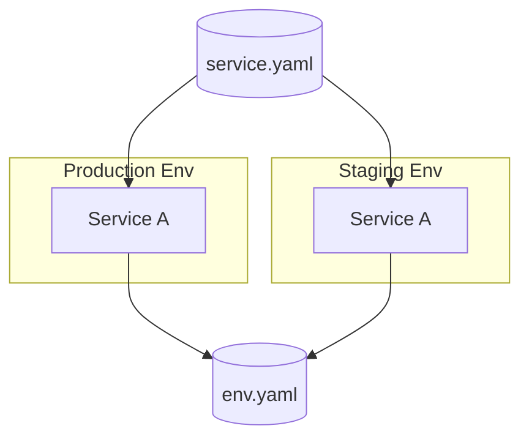

# Pltf

Pltf is a new kind of Infrastructure-as-Code framework built for fast-moving startups. It lets teams work with high-level concepts like microservices, environments, and databases, instead of low-level configuration such as VPC, IAM, ELB, or Kubernetes.

We've always been frustrated by the amount of manual effort required to manage infrastructure. We strongly believe in developer productivity, and empowering engineers has been our mission for the past few years.

With Pltf, we're reimagining how infrastructure should be managed in modern cloud environments. Pltf enables anyone to build automated, scalable, and secure infrastructure across AWS, GCP, and Azure. Our early users save countless hours every week and are able to scale their companies with minimal investment in DevOps.

Pltf gives you:

- SOC2 compliance from day one
- AWS, GCP, and Azure support
- Continuous deployment
- Hardened network and security configurations
- Support for multiple environments
- Built-in auto-scaling and high availability (HA)
- Support for spot instances
- Zero lock-in
- Out-of-the-box wiring between modules
- Out-of-the-box provider management
- Bring-your-own modules
- Out-of-the-box support for tfsec, tflint, infracost, and rover (https://github.com/yindia/rover)

## Install

Homebrew (macOS/Linux):
```bash
brew install yindia/homebrew-yindia/pltf
```

Install script (macOS/Linux/Windows via WSL or Git Bash):
```bash
curl -fsSL https://raw.githubusercontent.com/yindia/pltf/refs/heads/main/install.sh | sh
```

More options in `docs/installation.md`.

## How it works

The idea is simple:

1. Platform teams define the core infrastructure using either their own modules or existing CLI modules.
2. Application teams deploy services on top of these base environments using higher-level abstractions.
3. Services become layered components within the Pltf ecosystem.

Our CLI reads these environments, services, and stacks to generate Terraform automatically. Once generated, teams can either commit the Terraform code or use our CLI to run Terraform commands directly.

In addition, Pltf integrates with infracost, tfsec, and tflint, and provides an AI-powered summary of the plan and risk assessment directly in pull requests.


## Spec foundations



### Stack spec

Stacks capture reusable infrastructure modules (networking, observability, etc.) and publish outputs for services. Each stack can list required providers so environments treat every module consistently.

Example (from `stacks/example-eks-stack.yaml`):
```yaml
apiVersion: platform.io/v1
kind: Stack
metadata:
  name: example-eks-stack
variables:
  cluster_name: "pltf-data-${env_name}"
modules:
  - id: base
    type: aws_base
  - id: eks
    type: aws_eks
    inputs:
      cluster_name: "pltf-app-${env_name}"
      kms_account_key_arn: module.base.kms_account_key_arn
      k8s_version: 1.33
      enable_metrics: false
      max_nodes: 15
```

### Environment spec

An environment wires stacks, backends, provider secrets, variables, and images into a workspace. Each environment can define multiple variants (`dev`, `prod`, …) and services refer to the environment by file path.

Example (from `example/e2e.yaml`):
```yaml
apiVersion: platform.io/v1
kind: Environment
gitProvider: github
metadata:
  name: example-aws
  org: pltf
  provider: aws
  labels:
    team: platform
    cost_center: shared
  stacks:
    - example-eks-stack
# images:
#   - name: platform-tools
#     context: .
#     dockerfile: Dockerfile
#     platforms:
#       - linux/amd64
#       - linux/arm64
#     tags:
#       - ghcr.io/example/${layer_name}:${env_name}
#     buildArgs:
#       ENV: ${env_name}
environments:
  dev:
    account: "556169302489"
    region: ap-northeast-1
  stage:
    account: "556169302489"
    region: ap-northeast-1
  prod:
    account: "556169302489"
    region: ap-northeast-1
variables:
  replica_counts: '{"dev":1,"prod":3}'
  environment_settings: '{"region":"us-west-2","zones":["us-west-2a","us-west-2b"]}'
modules:
  - id: nodegroup1
    source: ../modules/aws_nodegroup
    inputs:
      max_nodes: 15
      node_disk_size: 20
  - id: postgres
    source: https://github.com/yindia/pltf.git//modules/aws_postgres?ref=main
    inputs:
      database_name: "${layer_name}-${env_name}"
  - id: s3
    type: aws_s3
    inputs:
      bucket_name: "pltf-app-${env_name}"
    links:
      readWrite:
        - adminpltfrole
        - userpltfrole
  - id: topic
    type: aws_sns
    inputs:
      sqs_subscribers:
        - "${module.notifcationsQueue.queue_arn}"
    links:
      read: adminpltfrole
  - id: notifcationsQueue
    type: aws_sqs
    inputs:
      fifo: false
    links:
      readWrite: adminpltfrole
  - id: schedulesQueue
    type: aws_sqs
    inputs:
      fifo: false
    links:
      readWrite: adminpltfrole
  - id: adminpltfrole
    type: aws_iam_role
    inputs:
      extra_iam_policies:
        - "arn:aws:iam::aws:policy/CloudWatchEventsFullAccess"
      allowed_k8s_services:
        - namespace: "*"
          service_name: "*"
  - id: userpltfrole
    type: aws_iam_role
    inputs:
      extra_iam_policies:
        - "arn:aws:iam::aws:policy/CloudWatchEventsFullAccess"
      allowed_k8s_services:
        - namespace: "*"
          service_name: "*"
```

Secrets (AWS, GCP, Vault, etc.) attach to the environment and are injected via standard credential files. Environments describe the shared infrastructure that every service reuses.

### Service spec

Services declare workload-specific modules, images, and secrets while referencing one environment file. A single service can target any number of variants defined under `envRef`.

```yaml
apiVersion: platform.io/v1
kind: Service
metadata:
  name: billing
  ref: ./env.yaml
  envRef:
    dev: {}
modules:
  - id: billing-api
    type: helm_chart
    inputs:
      chart: ./services/billing/chart
      repo: ./services/billing
      values:
        cluster: module.eks.cluster_name
        replicas: var.replica_count
images:
  - name: billing-api
    context: ./services/billing
    tags:
      - ghcr.io/acme/billing:${env_name}
```

Services live wherever their referenced environment variants exist; variables and secrets are defined at the top level.

### Custom modules

Bring your own Terraform modules (even ones that require non-cloud providers such as GitHub) by dropping a `module.yaml` beside the code or referencing the repo directly. When `source` is present you do not need `type`, and `source` accepts HTTP or SSH git URLs.

```yaml
modules:
  - id: billing-api
    source: https://github.com/acme/custom-modules.git//modules/billing-api
    inputs:
      image: ghcr.io/acme/billing:${env_name}
      replicas: 3
```

pltf caches module clones per repo/commit so repeated plans avoid git overhead, and the module metadata still controls inputs/outputs/outputs. If a module pulls in a custom provider (e.g., `github`), declare that provider inside the module and reference it in the consuming environment so Terraform understands the dependency graph.

## Workflow & commands

- `pltf terraform plan` builds declared Docker images using the Dagger cache, renders `.tf`/`.tfvars`/`.terraformrc`, reuses provider plugins, streams tfsec/Infracost/Rover logs, and writes `.pltf-plan.tfplan`.
- `pltf terraform apply` reuses that plan, pushes built images and runs `terraform apply -auto-approve`, while `pltf terraform destroy` skips image builds and still runs `terraform destroy -auto-approve`.
- `pltf terraform graph/output` run after plan/apply to inspect dependency graphs or module outputs without extra wrappers.
- `pltf preview` and `pltf validate` check wiring and run tfsec, printing both the summary timings and problem list for quick triage.
- `pltf module list/get/init` inspect or bootstrap modules from both the embedded catalog and your Git sources.

Commands render workspaces under `.pltf/<environment_name>/workspace` or `.pltf/<environment_name>/<service_name>/workspace`, ensuring `plan` and `apply` operate on the same graph.

## Image & Terraform caching

- Image builds always go through Dagger, and the shared `pltf-image-cache` layer keeps BuildKit state between plan/apply runs. `platforms` lists in the spec drive multi-arch builds; omit them to default to the host architecture.
- Terraform commands run on the host binary, and plugin downloads happen once per workspace inside `.terraform/plugins`. There is no `.terraform-plugin-cache` layering beyond the standard Terraform layout.

## Behavior & rules

- Stacks merge before generation; environment/service overrides cannot mutate stack modules.
- Providers are explicit—if you inject custom providers such as GitHub or Datadog, declare them inside the module and register them in the consuming environment/service.
- Variables and secrets propagate from stack → environment → service; overrides raise errors when they conflict.
- `apply` and `destroy` always use `-auto-approve`, while plan commands accept `--scan`, `--cost`, and `--rover`.

## Provider coverage

| Provider | Status |
|----------|--------|
| AWS      | ✅     |
| GCP      | ✅     |
| Azure    | ✅     |

## Contributing

- Follow the docs in `docs/` (see `mkdocs serve` locally) before sending a PR.
- Open issues or PRs with reproducible steps, sample specs/modules, and the `go` command output you ran.
- Keep diffs focused; prefer updating docs in parallel with code.

This repo currently passes `go test`? Not in this environment—compiler caches are not writable and the Go toolchain version may differ from your machine.
