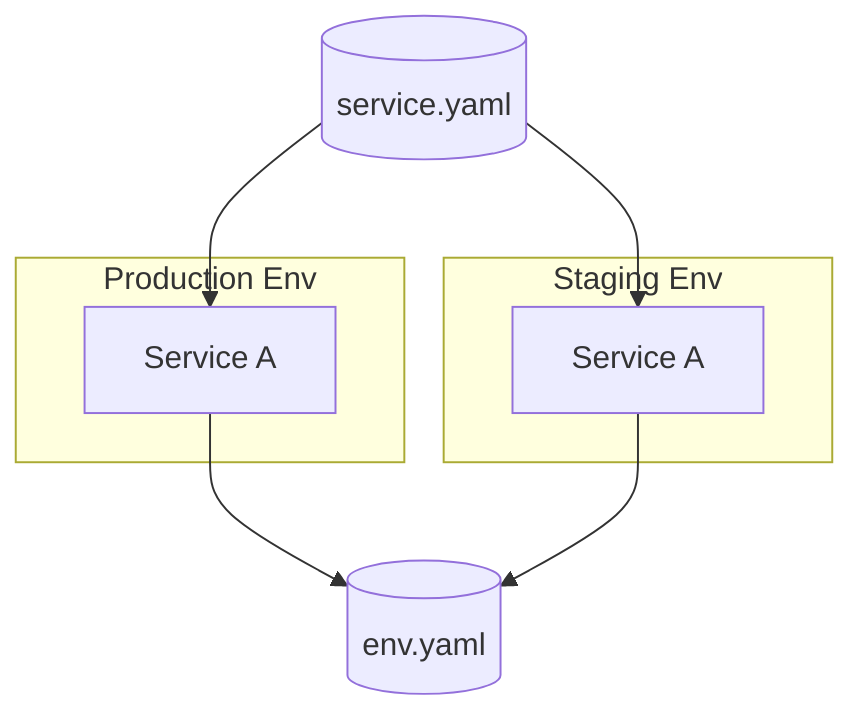

# pltf

pltf is a Kubernetes-native CLI that transforms spec-driven intents into ready-to-run Terraform workspaces. Define stacks, environments, and services once, let pltf wire providers/backends/Helm charts, and run the host `terraform` binary so your deployments stay portable but repeatable.

## Why teams rely on pltf

- **Kubernetes-native workflows** – embed EKS, Helm charts, and Kubernetes modules while Terraform manages state and providers.
- **Spec-first operations** – YAML specs capture backend, stacks, variables, and secrets instead of replicating Terraform code per env.
- **Image + Terraform caching** – Docker images build through Dagger with shared caches; Terraform runs natively with provider reuse.
- **Custom modules welcome** – register built-in modules by `type` or point to git repos via `source` (HTTP/SSH) without a global `modules_root`.
- **Security + cost guardrails** – tfsec/Infracost/Rover run with every Terraform plan and stream both timings and problem lists.

## Quick links

- [Installation](installation.md)
- [Getting Started](getting-started/aws.md)
- [Specs guide & modules](specs.md)
- [Platform CLI commands](platform.md)
- [Terraform workflows](workflows.md)
- [Caching strategies](caching.md)
