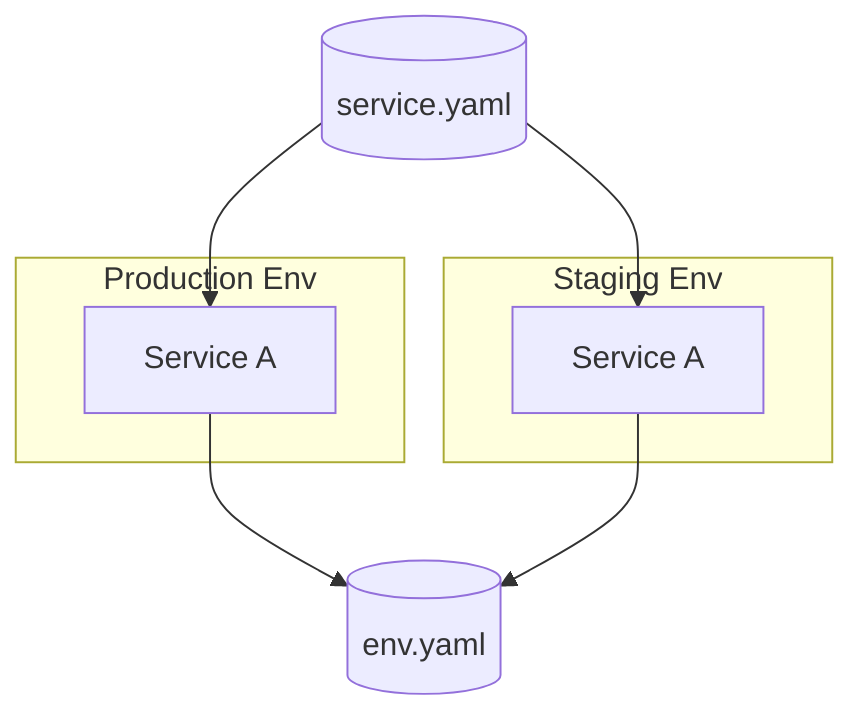

# pltf

pltf is a Kubernetes-native CLI that turns your high-level infrastructure intent into ready-to-run Terraform workspaces. Define reusable stacks, reuse environment wiring, and deploy services that consume Helm charts or cloud modules while staying close to Terraform best practices; the generated workspaces run the host `terraform` binary so you never trade portability for automation.

## Why teams use pltf
- **Kubernetes-native IaC** – embed EKS clusters, Helm charts, and service modules while keeping Terraform state and providers under host control.
- **Spec-first deployments** – capture stacks, environments, and services in YAML/JSON, and let pltf generate provider/backends, locals, and wiring for every run.
- **Image builds without surprises** – Docker images in your specs build through Dagger with shared caches, but Terraform commands run natively (no embedded Dagger layers).
- **Fast feedback loops** – `pltf terraform plan` produces tfsec/cost summaries, and `apply`/`destroy` always pass `-auto-approve` so CI/CD stays deterministic.
- **Bring-your-own modules** – use the built-in catalog or drop a `module.yaml` beside your Terraform code; pltf treats every module equally.

## Grounded example

- `example/stack.yaml` (and `example/stacks/*`) define reusable cluster building blocks.
- `example/env.yaml` defines an AWS environment (`example-aws`) and references stacks for EKS, DNS, and observability.
- `example/service.yaml` defines a Helm-based service that binds to the environment, pedals secrets, and builds images for each referenced env.

## Typical workflow
1. Define or update your stack, environment, and service specs.
2. Validate, preview, and lint wiring:
   - `pltf validate -f example/env.yaml`
   - `pltf preview -f example/service.yaml --env prod`
3. Run Terraform:
   - `pltf terraform plan -f example/service.yaml --env prod --scan`
   - `pltf terraform apply -f example/service.yaml --env prod`
4. Inspect outputs/graphs:
   - `pltf terraform output -f example/service.yaml --env prod`
   - `pltf terraform graph -f example/service.yaml --env prod | dot -Tpng > graph.png`

## Quick links
- [Installation](installation.md)
- [Getting Started](getting-started/aws.md)
- [Platform Usage](platform.md)
- [CLI Reference](usage.md)
- [Spec Guide](specs.md)
- [Modules & Wiring](modules.md)
- [Features](features.md)
- [Security](security/aws.md)
